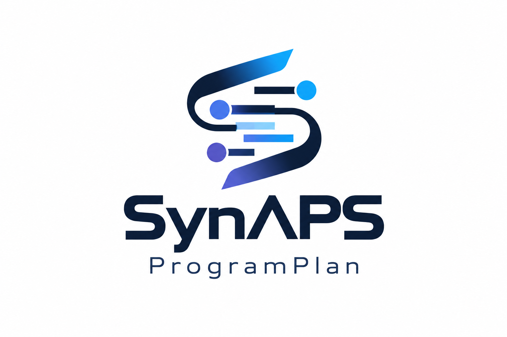
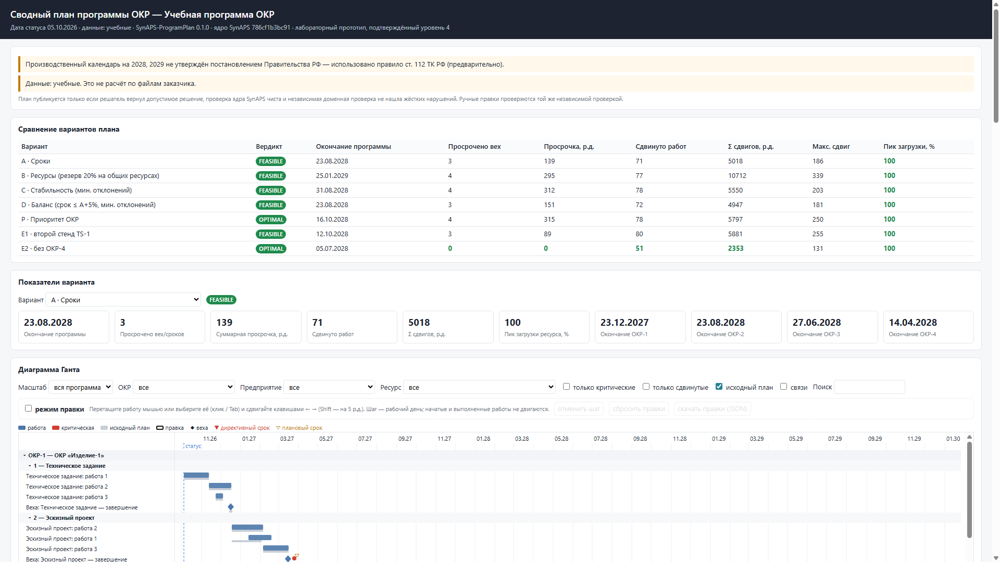
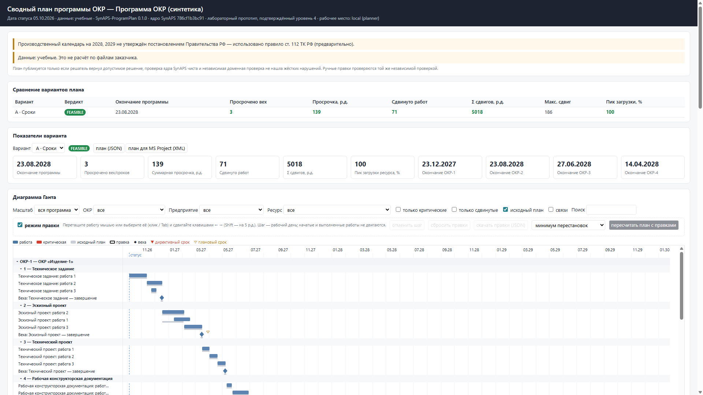
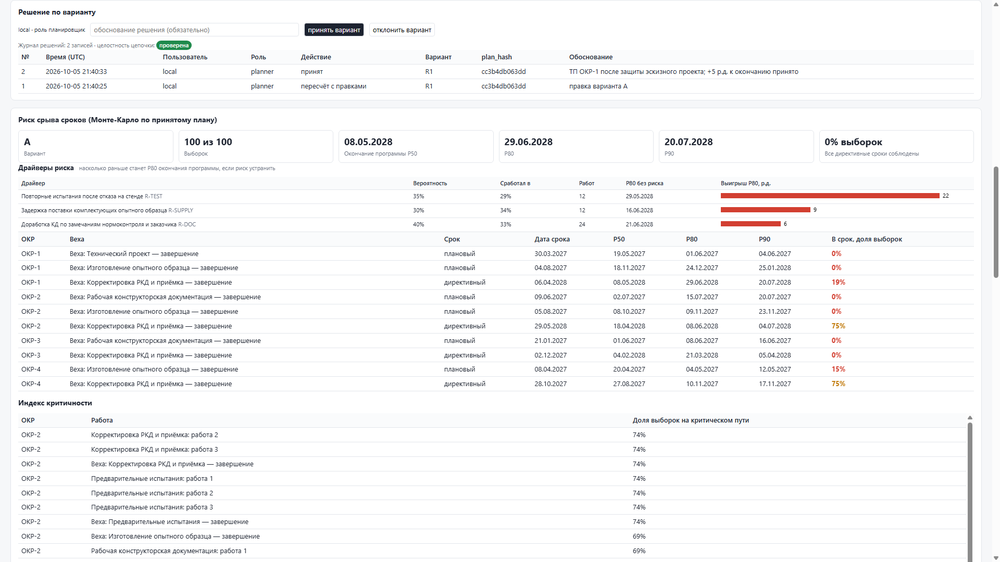

<p align="center">
  
  <br><br>
  <b>Presentation for UEC · 19 slides</b>
  <br><br>
  <a href="SynAPS-ProgramPlan_ODK.pptx"></a>
  &nbsp;
  <a href="SynAPS-ProgramPlan_ODK.pdf"></a>
</p>

# SynAPS-ProgramPlan

[Русский](README.md)

A consolidated schedule for a programme of development projects. Several projects, shared people and test stands, links and deadlines come together in one plan, and that plan is checked twice. Every moved task carries a reason. Every milestone carries a measure of how likely it is to slip.

## What it is for

When a programme is kept as a set of separate project plans, the consolidated schedule is assembled by hand. That takes days, and a clash over a shared stand usually appears only after the plans have been merged. Showing that a mandated deadline cannot be met, and naming the requirements that conflict, is hardly possible in that process. After any edit it is unclear why everything else moved.

SynAPS-ProgramPlan does this work:

- reads plans from MS Project, Primavera P6 and Excel and merges them into one programme;
- finds contention for people and stands before any optimisation;
- builds a consistent schedule and several alternatives, set out in one table for the manager to compare;
- when a deadline cannot be met, proves it and names the requirements that conflict;
- explains every move: which link, which resource or which window holds the task;
- estimates the risk of missing milestones and shows which risk moves the programme finish the most;
- lets the planner drag a task and checks the edit at once;
- writes every decision into a hash-chained journal: a changed, deleted or reordered record inside the file is detected. Replacing the file together with its seal is detected when the hash of the last record is kept outside the system.

The schedule is computed by the [SynAPS](https://github.com/KonkovDV/SynAPS) kernel on the Google OR-Tools CP-SAT solver. Every plan, whether computed or edited by hand, then passes a second check written apart from the solver and independent of its code.



## Results on public problem sets

The scheduler has been measured on the public sets used by research groups and solver authors.

| Set | Instances | Result |
|---|---:|---|
| PSPLIB j30, 30 activities | 480 | All 480 plans accepted. On 476 the duration equals the known optimum; optimality is proved for 472. Mean gap to the optimum 0.013%, mean time 0.21 s |
| PSPLIB j60, 60 activities | 480 | All 480 plans accepted, optimality proved for 405. Mean time 2.05 s |
| PSPLIB j120, 120 activities | 600 | All 600 plans accepted, optimality proved for 259. Mean time 7.43 s |
| RCPSP/max j10, j20, j30 | 810 | Start-to-start links, minimum and maximum lags. Every instance known to be infeasible is proved infeasible. Known optima match on every instance except one |
| Study programmes | 3 sizes | Up to 64 projects and 2,688 activities. A plan is accepted at every size. CP-SAT cuts the greedy plan's total tardiness by 54%, 45% and 28% |

Runs use a 10 s solver limit per instance (60 s for the study programmes), one thread and a fixed random seed. Commands and the full tables are in [`docs/quality-assurance.md`](docs/quality-assurance.md). Automated tests: 196.

## What the programme manager gets

| Requirement | How it is met |
|---|---|
| **F1. One plan** from the plans of the separate projects | MS Project files (XML, and MPP or MPX through the MPXJ library), Primavera P6 XER exports with several projects in one file, and an Excel workbook. Resources that share a name across files become shared. A stand that is spelled differently in two files is joined by a name table. Cross-project links for MS Project come from a CSV table. Anything the import did not carry across exactly is listed in a report with a code. In strict mode a programme with a loss is not written |
| **F2. Links, milestones, dates and constraints** | Four link types, with lag and maximum lag. Milestones. Mandated and planned dates. A shift limit, pinning, and a freeze on the near weeks. Leave and stand maintenance. The Russian production calendar from the government decrees for 2025–2027. A task may name a product, a configuration and a prototype: the prototype occupies a resource of capacity 1, so its tests run one after another. A task that has not started may carry several execution modes in JSON: CP-SAT keeps one, and the greedy dispatcher answers `UNSUPPORTED_MODEL`. Between different stand states there is a changeover interval, and those days are not added to the task duration. Excel and MS Project XML do not carry the mode list or the changeover matrix. MMLIB50 is not in the repository |
| **F3. Conflicts and schedule risk** | Before the solve: overloads, projects competing for one resource, broken links, impossible and tight dates, faults in the source data. After the solve: P50, P80 and P90 for the programme and for each milestone, the share of samples in which the milestone is on time, task criticality, and a risk register with the working days each risk adds to P80 |
| **F4. Alternative plans** | Deadlines, resource reserve, stability, balance, project priority, what-if (add a stand, move a milestone, drop a project, lengthen a task) and a plan that keeps the planner's edits. All of them sit in one comparison table; identical plans are collapsed |
| **F5. Gantt, loading, critical work, reasons for change** | The report opens in a browser with no network. The planner's desk: a Gantt chart, drag and keyboard edits, an immediate check, a reschedule that moves as little as possible, a loading heatmap, a reason for every move, decisions with a written justification in the journal, user roles, and an export of the accepted plan back to MS Project. A project or a stage folds, the chart filters by plant and resource, the original dates stay visible, and a milestone with a P80 estimate carries a green or a red dot |

Which module and which test covers each requirement is in [`docs/traceability-matrix.md`](docs/traceability-matrix.md). The guides are in Russian.



## Why a plan can be trusted

A plan reaches the report, the chart, the planner's desk and the service response only when all three hold:

1. the solver found a feasible schedule;
2. the SynAPS kernel check found no violation;
3. an independent check walked the dates, links, loading, calendar and pins again and found nothing either.

An edit made with the mouse goes through the same independent check as a computed plan. Every plan carries a hash of the input and a hash of the result. If the dates in the file change while the hash stays the same, or the plan was computed for a different programme, it is neither shown nor exported.

Each run has one verdict:

| Verdict | Meaning |
|---|---|
| `OPTIMAL` | The plan is accepted, and it is proved that the chosen objective cannot be improved |
| `FEASIBLE` | The plan is accepted and checked. The solver found a good schedule and did not finish the proof that none is better |
| `HEURISTIC_FEASIBLE` | The plan is accepted and checked. It was built by the fast greedy method |
| `INFEASIBLE` | It is proved that the programme cannot be scheduled under these dates, links and resources. The conflicting requirements are named, with how far each one has to move |
| `REJECTED` | The solver returned a schedule, and the check found a violation. That plan is not shown |
| `ERROR` | There is no plan, and infeasibility is not proved: the time limit ran out, for example |
| `UNSUPPORTED_MODEL` | There is no plan: the programme has execution modes and the chosen solver does not encode them. That is how the greedy dispatcher answers. No dates are published |

Every verdict and every violation code is in [`docs/reference-codes.md`](docs/reference-codes.md).

## Try it

Python 3.12 or newer.

```text
pip install "SynAPS-ProgramPlan[api] @ git+https://github.com/KonkovDV/SynAPS-ProgramPlan.git"
SynAPS-ProgramPlan demo --projects 4 --time-limit 8 --risk-runs 40 --out-dir out/demo
SynAPS-ProgramPlan doctor --demo out/demo
SynAPS-ProgramPlan serve out/demo/program.json out/demo/plan_A.json out/demo/plan_D.json --journal out/demo/decisions.jsonl --risk-runs 40
```

`demo` spends about a minute building the demonstration in the next section. `doctor` computes nothing: it checks the install and matches every built plan against the programme by hash. Exit code 0 means the machine is ready. `serve` opens the planner's desk at `http://127.0.0.1:8765/`. It is the same report, and from it you edit the plan, reschedule, record a decision and keep the journal.

## Demonstration

A study programme of four projects across four invented sites: a design bureau, a pilot plant, a test station and a series plant. The report header says the data are a study set and the confirmed level is 4. The effect named in the request is measured on the pilot. The language model stays off and does not use the network.

The command above writes `out/demo` (the directory is not in git):

- `report.html` — the comparison, the chart, loading, reasons for moves, conflicts before the solve, and risk;
- `report_infeasible.html` — a programme whose deadline cannot be met, with no consolidated-plan dates;
- `program.json`, `plan_*.json`, `plan.xml`, `risk_A.json` — the programme, the plans with their hashes, the MS Project export and the risk estimate.

Open both HTML files before the meeting. The order of the screens and the MS Project round trip are in the [demonstration script](docs/acceptance/demo-script.md) (Russian). Installing on the customer's machine, offline included, checking it, and what to do if something fails are in the [stand guide](docs/acceptance/demo-stand.md) (Russian). Running the command again with a different time limit, or on a machine of different speed, may produce a different plan: keep the files built by this command.

On this build the Deadlines alternative is accepted as `FEASIBLE`: programme finish 23 August 2028, milestone tardiness 139 working days against the planned dates, 71 tasks moved. Eight seconds were not enough to prove nothing shorter exists. `OPTIMAL` on other rows is optimality for that alternative's own objective. A peak of 100% means the busiest resource is fully used on some day; a plan that exceeds capacity is not shown.

The P80 of the programme finish under the accepted plan is 9 March 2029. Every risk sample meets the mandated dates; the 139 days of tardiness are against the planned dates. A second stand and a programme without one project appear in the comparison table: they were solved on a changed programme, so their bars are not drawn on the chart of the original one. The menu marks them «только в таблице». The infeasible page names one requirement: the mandated date of project 4's certification milestone, 14 December 2027.

## The working cycle

| Step | Command | Result |
|---|---|---|
| 1. Template | `SynAPS-ProgramPlan template --out program.xlsx` | An Excel workbook with every sheet, including the risk register |
| 2. One programme | `SynAPS-ProgramPlan import okr1.xml okr2.xml --codes okr1 okr2 --links links.csv --aliases names.csv --strict --losses losses.json --out program.json` | One programme with shared resources, and an import report. In strict mode an incomplete transfer exits with code 2 and writes nothing |
| 3. Conflicts | `SynAPS-ProgramPlan analyze program.json` | Overloads, resource contention, broken links, tight dates, faults in the data |
| 4. Alternatives | `SynAPS-ProgramPlan scenarios program.json --out-dir out --explain` | Plans and a comparison table |
| 5. An impossible deadline | `SynAPS-ProgramPlan witness program.json` | The conflicting requirements and how far to relax them |
| 6. Risk | `SynAPS-ProgramPlan risk program.json out/plan_A.json --out risk.json` | P50, P80, P90, the chance of each milestone being on time, the contribution of each risk |
| 7. Report | `SynAPS-ProgramPlan report program.json out/plan_A.json out/plan_D.json --risk-runs 200 --out report.html` | Comparison, Gantt, loading, risk, reasons for moves |
| 8. Planner's desk | `SynAPS-ProgramPlan serve program.json out/plan_A.json out/plan_D.json --journal decisions.jsonl` | Edit, check, reschedule, decisions, journal |
| 9. Check edits without the server | `SynAPS-ProgramPlan check program.json out/plan_A.json --moves edits_A.json`, then `replan … --moves edits_A.json --out plan_R1.json` | Violations introduced by the edits, and a new plan with those edits held fixed |
| 10. Back to MS Project | `SynAPS-ProgramPlan export program.json out/plan_A.json --out plan_A.xml` | The accepted plan: dates, links, resources, deadlines, baseline 0, the horizon bounds and the plan hash. A strict re-import of this file succeeds |
| 11. A new status date | `SynAPS-ProgramPlan repair program.json out/plan_A.json --status-date 2027-03-01 --freeze-wd 10 --out plan2.json --out-program program2.json` | A plan from the new date. The next 10 working days stay put |
| 12. Journal | `SynAPS-ProgramPlan journal decisions.jsonl --tail 5` | The latest decisions, and a check that the journal has not been altered |

`SynAPS-ProgramPlan diff before.json after.json` lists the tasks, links, resources and dates that differ. A file with no `schema_version` is read as the current schema. An unknown version exits with code 2.

Each step is worked through with examples in [`docs/user-guide.md`](docs/user-guide.md).



## The effect to measure

| Effect | How | Measured on the pilot |
|---|---|---|
| Less effort on the consolidated plan | Import and merge, automatic conflict search, a reschedule in one command | Person-days per update cycle, before and after |
| Plans that can be carried out | Only a plan with no overload and no broken link is accepted. An edit is checked by the same rules | Share of tasks started inside their planned window |
| Fewer missed dates | P80 and the chance of each milestone being on time, the contribution of each risk, what-if plans, a proof of infeasibility | Milestone tardiness, P80 before and after the measures |
| A reasoned split of specialists and stands | Contention is visible before the solve. Reserve and balance alternatives. Day-by-day loading | Overloads and peak loading in each alternative |
| Decisions that can be traced | A reason for every move. A journal of who decided what, and why, tied to the plan version | Expert rating of clarity, completeness of the journal |

The pilot sequence and the acceptance criteria are in [`docs/pilot-and-roadmap.md`](docs/pilot-and-roadmap.md).

## Customer

The customer is the United Engine Corporation, an integrated group that develops, builds and services gas-turbine engines, site [www.uecrus.com](https://www.uecrus.com). Request no. 1 is a consolidated schedule for a development programme that shares specialists, test stands, links and dates. The request is open until 31 December 2026. The requirements, the effect the customer expects and the pilot sequence are in [`docs/pilot-and-roadmap.md`](docs/pilot-and-roadmap.md) (Russian).

## Customer data

Customer data is not stored in the repository and does not leave the closed network. Only anonymised plans are used. Every programme records where it came from: a study set, a public set, anonymised customer data, or an experiment. The report shows that on the first screen. With no roles configured, the planner's desk answers only on the same computer. Language models take no part in the calculation: they create no constraints and do not change the plan. Explanations are built only from the facts of a checked plan. See [`docs/security-and-data.md`](docs/security-and-data.md).

## Documentation

The guides below are in Russian.

| Document | Subject |
|---|---|
| [Planner's guide](docs/user-guide.md) | Preparing data, import, alternatives, risk, the desk, the journal, rescheduling, common questions |
| [Data formats](docs/data-format.md) | Excel sheets, MS Project and Primavera field maps, the link table, the risk register, the edits file |
| [Codes](docs/reference-codes.md) | Verdicts, violations, conflicts, reasons for a move, exit codes, service responses |
| [Method](docs/methodology.md) | How a plan is built and checked, how alternatives, explanations and risk are computed, and how this sits in published practice |
| [Architecture](docs/architecture.md) | The parts of the system and the path the data takes |
| [Quality](docs/quality-assurance.md) | Tests, public-set runs, reproducibility |
| [Data and security](docs/security-and-data.md) | The closed network, anonymisation, roles, the journal, rules for AI |
| [Pilot](docs/pilot-and-roadmap.md) | The customer, request no. 1, the pilot stages, acceptance criteria |
| [Administrator's guide](docs/admin-guide.md) | Offline install, TLS, sign-in through a corporate proxy, the journal |
| [Acceptance](docs/acceptance/pmi.md) | Test procedure, specification, protocol template, demonstration script |
| [Demonstration stand](docs/acceptance/demo-stand.md) | Installing on the customer's machine, the `doctor` check, what to do if something fails |
| [Glossary](docs/glossary.md) | Planning terms |
| [Claims](CLAIMS_REGISTRY.md) · [Conditions of use](LIMITS.md) | The figures that may be cited, and the conditions under which they were measured |

## For developers

```text
git clone https://github.com/KonkovDV/SynAPS-ProgramPlan.git
cd SynAPS-ProgramPlan
pip install -e ".[dev,api]"
python -m pytest tests -q
python scripts/build_evidence.py --check
python scripts/lint_claims.py
ruff check src tests scripts
ruff format --check src tests scripts
mypy src
```

The SynAPS kernel is used in place and pinned to commit `d4837ab395170f786fae40791ceda9fc4c9b191d`. The same commit is recorded in `src/synaps_programplan/versions.py`, `pyproject.toml` and `CLAIMS_REGISTRY.md`. `tests/test_pin.py` checks that they agree. Generalised precedence was added to the kernel in [KonkovDV/SynAPS#45](https://github.com/KonkovDV/SynAPS/pull/45). Picking exactly one execution mode is [KonkovDV/SynAPS#46](https://github.com/KonkovDV/SynAPS/pull/46). Setup on a separate work center, which does not forbid modes on another lane, is [KonkovDV/SynAPS#47](https://github.com/KonkovDV/SynAPS/pull/47). Neither pull request is on the kernel `main` yet.

From a checkout: `python -m synaps_programplan`. There are two services. `SynAPS-ProgramPlan serve` keeps the journal, checks roles, and outside the local address speaks only over TLS. `uvicorn synaps_programplan.api:app` stores nothing: on the local address it answers at once, from anywhere else only with a token. Public-set runs: `python scripts/bench_psplib.py`.

Exit codes: `0` — a plan was accepted or the check passed, `1` — no accepted plan, or a violation was found, `2` — the input is invalid.

MIT licence.
