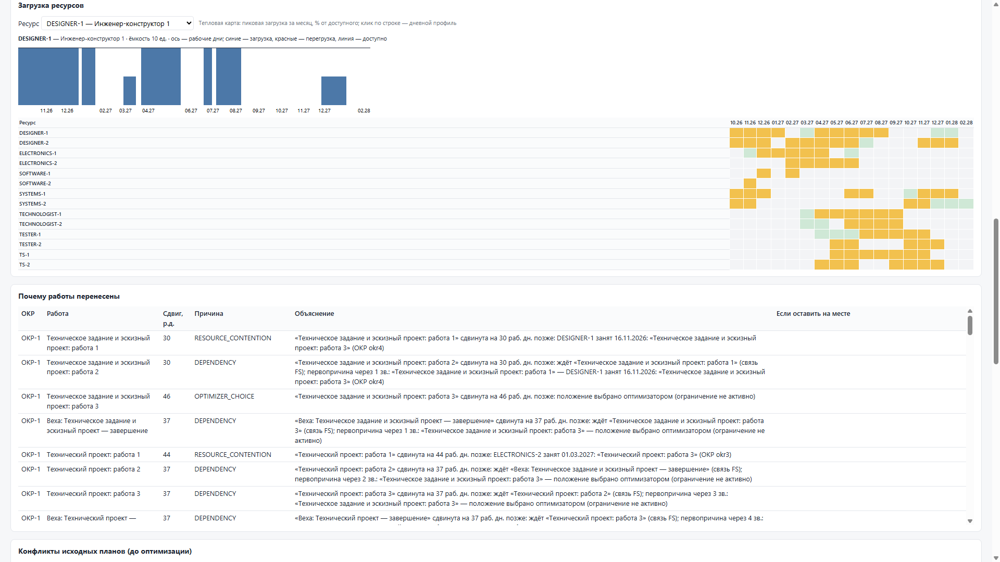

# SynAPS-ProgramPlan

**Сводный план программы ОКР: несколько проектов, общие люди и стенды, связи и сроки — в одном проверяемом плане с объяснением каждого переноса.**

SynAPS-ProgramPlan собирает планы отдельных ОКР (MS Project или книга Excel) в одну программу, находит конфликты за общие ресурсы, строит согласованный план и несколько альтернатив и показывает, почему каждая работа стоит там, где стоит. Расчёт выполняет ядро [SynAPS](https://github.com/KonkovDV/SynAPS) (решатель Google OR-Tools CP-SAT), а каждый итоговый план перед публикацией проверяется второй, независимой проверкой.

> **Уровень зрелости 0.1.0 — эксперимент.** Стенд проверен на синтетических программах и автоматических тестах: ISO 16290 TRL 4. Результатов на данных заказчика пока нет, оценка по ГОСТ Р 58048 не проводилась. Всё, что о системе можно утверждать, перечислено в [`CLAIMS_REGISTRY.md`](CLAIMS_REGISTRY.md); границы — в [`LIMITS.md`](LIMITS.md).


## Что получает руководитель программы

| Требование заказчика | Что делает SynAPS-ProgramPlan | Чего пока нет |
|---|---|---|
| **F1. Сводный план** программы из планов отдельных ОКР | Импорт нескольких файлов MS Project XML или одной книги Excel; одноимённые ресурсы разных проектов распознаются как общие; межпроектные связи — из отдельной таблицы CSV | Чтение Primavera XER, MPP и 1С |
| **F2. Связи, вехи, сроки и лимиты** | Связи «окончание–начало», «начало–начало», «окончание–окончание», «начало–окончание» с задержкой и максимальной задержкой; вехи; директивные (жёсткие) и плановые (мягкие) сроки; лимит сдвига; закрепление; заморозка ближнего горизонта; отпуска и ремонты; российский производственный календарь | Прерывание работы на выходные |
| **F3. Конфликты и риск срыва** | До оптимизации: перегрузки, конкуренция ОКР за один ресурс, нарушенные связи, невозможные и рискованные сроки, качество исходных данных. После: квантили P50/P80/P90 окончания и индекс критичности работ | Экспертная оценка на данных заказчика |
| **F4. Несколько вариантов** и их влияние | Варианты A «Сроки», B «Резерв ресурсов», C «Стабильность», D «Баланс», E «Что если» (добавить стенд, перенести веху, исключить ОКР, удлинить работу); таблица сравнения; одинаковые варианты сводятся в один | Пакет вариантов из одного вызова ядра |
| **F5. Гант, загрузка, причины изменений** | Самодостаточный HTML-отчёт (открывается без сети): Гант с исходным планом, критическими работами, вехами и сроками; тепловая карта загрузки; причина и первопричина каждого переноса; «что будет, если оставить работу на месте»; выгрузка принятого плана обратно в MS Project | Роли, журнал решений, база данных, правка мышью |

Подробная карта «требование → код → тест → документ»: [`docs/traceability-matrix.md`](docs/traceability-matrix.md).

## Как принимается план

План попадает в отчёт, диаграмму Ганта и HTTP-ответ, только если выполнены **все три** условия:

1. решатель вернул допустимое решение;
2. проверка ядра SynAPS не нашла нарушений;
3. независимая доменная проверка (`checker.py`, не использует решатель) не нашла ни одного жёсткого нарушения: сроков, связей, загрузки, календаря, закреплений.

Итог каждого расчёта — один вердикт:

| Вердикт | Что это значит для руководителя |
|---|---|
| `OPTIMAL` | План принят. Решатель доказал, что лучше по заданной цели на этой модели нельзя. |
| `FEASIBLE` | План принят. Он выполним и проверен, но за отведённое время не доказано, что он лучший. |
| `HEURISTIC_FEASIBLE` | План принят. Построен быстрым эвристическим методом и проверен. |
| `INFEASIBLE` | Доказано: при этих сроках, связях и ресурсах программа невыполнима. Система показывает, какие требования несовместимы и насколько их нужно ослабить. |
| `REJECTED` | Решатель что-то вернул, но проверка нашла нарушение. Такой план не показывается. |
| `ERROR` | Плана нет, и невыполнимость не доказана (например, кончилось время). |

Подробнее о вердиктах и кодах нарушений — в [`docs/reference-codes.md`](docs/reference-codes.md).

## Быстрый старт

Нужен Python 3.12 или новее.

```text
pip install "SynAPS-ProgramPlan @ git+https://github.com/KonkovDV/SynAPS-ProgramPlan.git"
SynAPS-ProgramPlan demo --out-dir out/demo
```

Команда `demo` за 1–3 минуты создаёт синтетическую программу из четырёх ОКР с общими стендами и людьми, строит варианты A–E и пишет в `out/demo`:

- `report.html` — отчёт по принятым вариантам;
- `report_infeasible.html` — пример программы с невозможным сроком и объяснением, что именно несовместимо;
- `program.json` и `plan_*.json` — исходные данные и планы с доказательной базой.

## Рабочий цикл

| Шаг | Команда | Результат |
|---|---|---|
| 1. Получить шаблон | `SynAPS-ProgramPlan template --out program.xlsx` | Книга Excel с листами и колонками |
| 2. Собрать программу | `SynAPS-ProgramPlan import okr1.xml okr2.xml --codes okr1 okr2 --links links.csv --out program.json` | Сводная программа, список общих ресурсов, отчёт импорта |
| 3. Найти конфликты | `SynAPS-ProgramPlan analyze program.json` | Перегрузки, конкуренция, нарушенные связи, рискованные сроки, качество данных |
| 4. Построить варианты | `SynAPS-ProgramPlan scenarios program.json --out-dir out --explain` | Планы A–E и таблица сравнения |
| 5. Понять невыполнимость | `SynAPS-ProgramPlan witness program.json` | Несовместимые требования и нужные послабления |
| 6. Собрать отчёт | `SynAPS-ProgramPlan report program.json out/plan_A.json out/plan_D.json --out report.html` | HTML: сравнение, Гант, загрузка, причины |
| 7. Оценить риск | `SynAPS-ProgramPlan risk program.json out/plan_A.json` | P50/P80/P90 окончания, риск по вехам, критичность |
| 8. Вернуть в MS Project | `SynAPS-ProgramPlan export program.json out/plan_A.json --out plan_A.xml` | Принятый план в формате MS Project XML |
| 9. Перепланировать | `SynAPS-ProgramPlan repair program.json out/plan_A.json --status-date 2027-03-01 --freeze-wd 10 --out plan2.json --out-program program2.json` | Новый план от даты статуса с заморозкой ближайших 10 рабочих дней |

Пошаговое руководство с примерами: [`docs/user-guide.md`](docs/user-guide.md).



## Документация

| Документ | Для кого и о чём |
|---|---|
| [Руководство планировщика](docs/user-guide.md) | Подготовка данных, импорт, варианты, объяснения, перепланирование, отчёт, частые вопросы |
| [Форматы данных](docs/data-format.md) | Листы и колонки Excel, сопоставление полей MS Project, CSV связей, сценарии «что если», состав плана |
| [Справочник кодов](docs/reference-codes.md) | Вердикты, нарушения, конфликты, качество данных, причины переносов, коды выхода |
| [Методология](docs/methodology.md) | Как строится и проверяется план, варианты, объяснения, риск; место в мировой практике 2026 года |
| [Архитектура](docs/architecture.md) | Компоненты, поток данных, связь с ядром SynAPS, HTTP-контур |
| [Качество и доказательность](docs/quality-assurance.md) | Тесты, атакующая проверка, детерминизм, доказательная база плана, дисциплина утверждений |
| [Данные и безопасность](docs/security-and-data.md) | Закрытый контур, обезличивание, происхождение данных, правила для ИИ |
| [Пилот и развитие](docs/pilot-and-roadmap.md) | Что нужно от заказчика, этапы пилота, критерии приёмки, план развития |
| [Глоссарий](docs/glossary.md) | Термины планирования и проекта |
| [Реестр утверждений](CLAIMS_REGISTRY.md) · [Границы](LIMITS.md) · [Аудит](AUDIT.md) · [Изменения](CHANGELOG.md) | Что утверждается, что нет, что проверено |

## Данные заказчика

Данные заказчика не хранятся в репозитории и не покидают закрытый контур. В работу принимаются только обезличенные данные, у каждой программы записано происхождение (`provenance`): синтетика, открытые данные, обезличенные данные заказчика или эксперимент. Отчёт показывает происхождение на первом экране. Языковые модели не создают ограничения и не меняют план; объяснения строятся только из фактов проверенного плана. Подробнее: [`docs/security-and-data.md`](docs/security-and-data.md).

## Для разработчиков

```text
git clone https://github.com/KonkovDV/SynAPS-ProgramPlan.git
cd SynAPS-ProgramPlan
pip install -e ".[dev]"
python -m pytest tests -q
python scripts/lint_claims.py
ruff check src tests scripts
mypy src
```

SynAPS подключается напрямую, без форка, и фиксируется коммитом `786cf1b3bc915941558e7e50b2935de684a32643` в `src/synaps_programplan/versions.py`, `pyproject.toml`, `CLAIMS_REGISTRY.md` и этом файле; тест `tests/test_pin.py` следит, чтобы они совпадали. Обобщённые связи в ядре добавлены в [KonkovDV/SynAPS#45](https://github.com/KonkovDV/SynAPS/pull/45). Запуск из исходников: `python -m synaps_programplan`. HTTP-контур без хранения данных: `uvicorn synaps_programplan.api:app` (только локально, без аутентификации).

Коды выхода команды: `0` — план принят или проверка чиста, `1` — принятого плана нет или найдено жёсткое нарушение, `2` — неверные входные данные.

Лицензия MIT.
