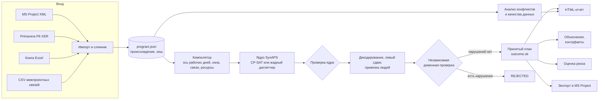
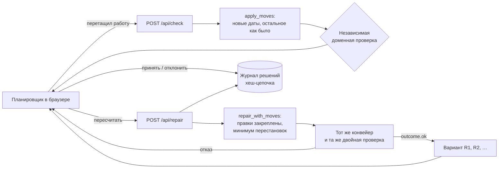

# Архитектура

SynAPS-ProgramPlan — тонкий доменный слой поверх ядра планирования [SynAPS](https://github.com/KonkovDV/SynAPS). Ядро отвечает за решение задачи расписания и свою проверку; этот слой — за всё, что относится к программе ОКР: данные, календарь, связи, сроки, варианты, правки, объяснения, риск, отчёт, рабочее место, журнал решений и независимую доменную проверку.

## Поток данных

Варианты A–E — это несколько проходов того же конвейера с разными целями и настройками. Свидетель невыполнимости — серия проходов с ослабленными требованиями.

### Цикл рабочего места

## Компоненты

| Модуль | Ответственность |
|---|---|
| `model.py` | Строгая модель программы: ОКР, структура работ, работы, связи, ресурсы, компетенции, исключения, база, заморозка, происхождение. Проверка ссылок, циклов, противоречивых лагов |
| `calendar.py` | Производственный календарь РФ и ось рабочих дней |
| `io/mspdi.py`, `io/xer.py`, `io/excel.py`, `merge.py` | Импорт MS Project XML, Primavera P6 XER и Excel, слияние проектов, распознавание общих ресурсов, межпроектные связи, экспорт принятого плана в MS Project |
| `io/psplib.py`, `scripts/bench_psplib.py` | Чтение задач PSPLIB и известных оптимумов, прогон бенчмарка через тот же конвейер |
| `conflicts.py`, `quality.py`, `cpm.py`, `capacity.py` | Анализ исходных планов: перегрузки, конкуренция, нарушенные связи, метод критического пути со всеми типами связей, качество данных |
| `compiler.py` | Перевод программы в задачу ядра: ось, окна, связи, посуточная доступность, вехи, цели |
| `planner.py` | Фасад расчёта: компиляция → ядро → декодирование → левый сдвиг → привязка людей → двойная проверка → вердикт → доказательная база |
| `binding.py` | Точная привязка потребностей по компетенции к людям (отдельная задача CP-SAT) |
| `checker.py` | Независимая доменная проверка. Не импортирует компилятор и решатель |
| `scenarios.py` | Варианты A–E, сравнение, сведение одинаковых вариантов |
| `explanations.py` | Причина и первопричина переносов, контрфакты, свидетель невыполнимости |
| `montecarlo.py` | Квантили P50/P80/P90, доля «в срок», драйверы риска и их вклад в P80, индекс критичности по принятому плану |
| `disrupt.py` | Перепланирование: новая дата статуса, факт, заморозка, задержки, выбытие ресурсов |
| `edits.py` | Ручные правки: перенос работ с привязкой к рабочим дням, проверка правок независимой проверкой, пересчёт с закреплёнными правками |
| `journal.py` | Журнал решений: запись только в конец, хеш-цепочка SHA-256, проверка целостности |
| `auth.py` | Роли и права (планировщик, руководитель, наблюдатель), токены из переменной окружения |
| `workbench.py` | Рабочее место: HTTP-сервер поверх отчёта, проверка и пересчёт правок, решения, выгрузка, восстановление вариантов после перезапуска |
| `report.py`, `report_template.html` | Самодостаточный HTML-отчёт без внешних зависимостей; тот же файл служит интерфейсом рабочего места |
| `evidence.py`, `versions.py` | Хеши, версии, коммит ядра, среда выполнения |
| `cli.py`, `api.py` | Командная строка и вычислительный HTTP-контур поверх тех же функций |
| `synthetic.py` | Генератор синтетических программ для демонстрации и тестов |

## Связь с ядром SynAPS

- **Без форка.** SynAPS подключается как зависимость напрямую из исходного репозитория и **фиксируется коммитом**, а не веткой: `786cf1b3bc915941558e7e50b2935de684a32643`. Тест `tests/test_pin.py` сверяет коммит в `pyproject.toml`, `versions.py`, `README.md` и `CLAIMS_REGISTRY.md`.
- **Изменения ядра — обратно совместимы.** Для ОКР в ядро добавлены обобщённые связи `PrecedenceEdge` (FS/SS/FF/SF, min/max лаги) в CP-SAT, жадном диспетчере и проверке ядра; существующие задачи и тесты ядра не меняются. Решатель, который рёбра не поддерживает, получает отказ, а не молчаливое игнорирование.
- **Инвариант ядра:** `FEASIBLE` ⇒ нет доказанных жёстких нарушений. Доменный слой добавляет вторую, независимую проверку поверх него.

## Принципы, заложенные в архитектуру

1. **Отказ по умолчанию.** Любой сбой проверки, ошибка решателя или неподдерживаемая конструкция ведёт к отказу от плана, а не к «лучшему из возможного». Непринятый план не попадает в отчёт, экспорт, риск и HTTP 200.
2. **Разделение «нашёл» и «доказал».** Вердикты `OPTIMAL` и `INFEASIBLE` ставятся только при доказательстве CP-SAT на полной модели.
3. **Объяснение — из фактов.** Тексты объяснений собираются из структурированных причин итогового плана.
4. **Воспроизводимость.** Хеш входа, хеш настроек, коммит ядра, версии библиотек и `plan_hash` пишутся в каждый план.
5. **Ничего не теряется молча.** Всё, что импорт приблизил или пропустил, попадает в отчёт импорта; невлезшие выборки риска — в `scheduled_runs`; переход пересчёта к переоптимизации — в `metadata.replan`.
6. **Один интерфейс — два режима.** Статический отчёт и рабочее место — один и тот же HTML. В статическом режиме данные встроены в файл, а проверка правок предварительная; в рабочем месте данные загружаются с сервера, и правки проверяет сервер.

## Два HTTP-контура

**Рабочее место** (`SynAPS-ProgramPlan serve`) — сервер для планировщика и руководителей. Держит в памяти одну программу и её принятые варианты, отдаёт отчёт, проверяет и пересчитывает правки, принимает решения и ведёт журнал (запросы — в [справочнике](reference-codes.md#рабочее-место-serve)). Все изменения состояния выполняются под одной блокировкой, поэтому одновременные запросы не портят нумерацию вариантов и журнал. Варианты R сохраняются в файлы и восстанавливаются после перезапуска только после сверки с журналом и повторной независимой проверки. Без ролей сервер отвечает только на локальном адресе; с ролями требует токен в каждом запросе.

**Вычислительный сервис** (`uvicorn synaps_programplan.api:app`) — те же функции, что командная строка: `GET /version`, `POST /analyze`, `POST /solve`, `POST /check`, `POST /risk`. Ничего не хранит и не ведёт журнал. Ответ 200 на `/solve` бывает только у принятого плана, на `/check` — только если независимая проверка не нашла жёсткого нарушения; иначе — 409. Аутентификации нет, поэтому сервис предназначен только для вызова внутри закрытого контура (см. [данные и безопасность](security-and-data.md)).

## Технологии

Python 3.12, Pydantic 2 (строгая модель), Google OR-Tools CP-SAT 9.15 (через ядро SynAPS), defusedxml (безопасный разбор XML), openpyxl (Excel), FastAPI и Uvicorn (необязательные HTTP-контуры), интерфейс на HTML и JavaScript без внешних библиотек и сетевых зависимостей. Качество кода: pytest, ruff, mypy в строгом режиме; CI на GitHub Actions.
